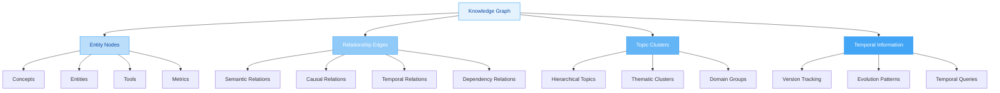
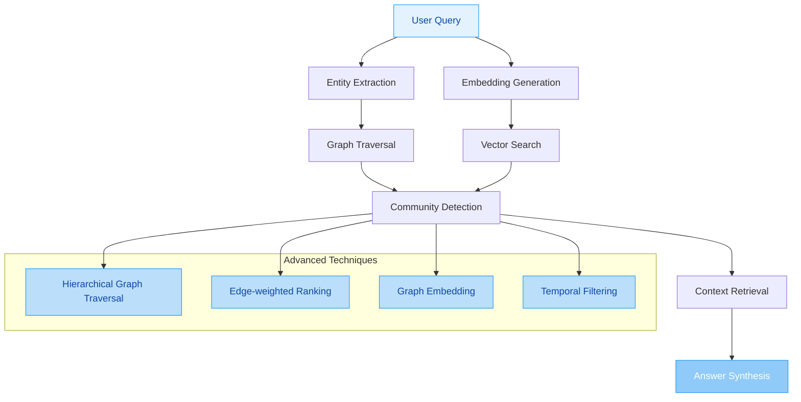

I'll conduct a comprehensive analysis of your research repository, identifying logical flaws, bugs, and opportunities for improvement to maximize LLM reasoning efficiency over your knowledge base.

## 📊 Executive Summary

Your repository implements a **sophisticated RAG (Retrieval-Augmented Generation) system** with GraphRAG capabilities, a Reasoning Agent, and a research-oriented interface. The architecture is sound, but there are several areas where **logical improvements**, **bug fixes**, and **architectural enhancements** can significantly boost LLM reasoning efficiency.

---

## 🔍 1. Critical Logical Flaws & Bugs

### 1.1 Event Loop Management Issues
**Location**: `app.py` (lines 8-9, 386-390, 426-434)

```python
# Current implementation
nest_asyncio.apply()  # Applied globally at module level
```

**Problems**:
- **Race condition risk**: `nest_asyncio.apply()` is called at module level, which can cause issues if multiple async operations run concurrently
- **Inconsistent pattern**: Event loop handling varies between ingestion and agent code, creating potential deadlocks
- **Streamlit compatibility**: Streamlit's own async handling may conflict with nest_asyncio's monkey-patching

**Fix**:
```python
# Recommended approach
import asyncio
import nest_asyncio

def safe_run_async(coro):
    """Consistent async execution pattern for Streamlit"""
    try:
        loop = asyncio.get_running_loop()
        if not isinstance(loop, asyncio.ProactorEventLoop):
            # Only apply if not already patched
            nest_asyncio.apply()
        return loop.run_until_complete(coro)
    except RuntimeError:
        # No running loop, create new one
        return asyncio.run(coro)
```

### 1.2 Embedding Cache Implementation
**Location**: `src/ai_engine.py` (lines 68-72)

```python
# Current naive eviction
if len(self._embedding_cache) >= self._cache_max_size:
    first_key = next(iter(self._embedding_cache))
    del self._embedding_cache[first_key]  # Removes oldest key, not truly LRU
```

**Problems**:
- **Not actually LRU**: Just removes the first key in dictionary iteration order (which is insertion order in Python 3.7+, but not access-based)
- **No recency tracking**: Frequently accessed embeddings get evicted too early
- **Memory inefficiency**: Could cache near-duplicates with slight variations

**Fix**:
```python
from functools import OrderedDict

class AIEngine:
    def __init__(self):
        self._embedding_cache = OrderedDict()  # Proper LRU tracking
        self._cache_max_size = Config.EMBEDDING_CACHE_SIZE
    
    def _cache_embedding(self, text: str, embedding: List[float]):
        cache_key = self._get_cache_key(text)
        # Move to end if exists (most recently used)
        if cache_key in self._embedding_cache:
            self._embedding_cache.move_to_end(cache_key)
        else:
            if len(self._embedding_cache) >= self._cache_max_size:
                self._embedding_cache.popitem(last=False)  # Remove least recently used
            self._embedding_cache[cache_key] = embedding
    
    def _get_cached_embedding(self, text: str) -> Optional[List[float]]:
        cache_key = self._get_cache_key(text)
        if cache_key in self._embedding_cache:
            self._embedding_cache.move_to_end(cache_key)  # Update access time
            return self._embedding_cache[cache_key]
        return None
```

### 1.3 Graph Entity Resolution Bug
**Location**: `src/ai_engine.py` (lines 383-408)

```python
# Problem: Case sensitivity and whitespace handling
def _normalize_graph_entities(self, data: Dict[str, Any]) -> Dict[str, Any]:
    # ...
    for node in nodes:
        if "name" in node:
            original = node["name"]
            canonical = self._resolve_entity_synonyms(original)  # Returns lowercase
            name_mapping[original.strip().lower()] = canonical
            node["name"] = canonical
```

**Problems**:
- **Information loss**: Converting all to lowercase loses case-sensitive distinctions (e.g., "Python" vs "python")
- **Synonym precedence**: Hard-coded synonyms take precedence over context-specific entity types
- **No disambiguation**: Multiple entities with same lowercase name get merged incorrectly

**Fix**:
```python
def _normalize_graph_entities(self, data: Dict[str, Any]) -> Dict[str, Any]:
    if not data:
        return {"nodes": [], "edges": []}
    
    nodes = data.get("nodes", [])
    edges = data.get("edges", [])
    
    # Build disambiguation map using both name AND type
    entity_map = {}
    for node in nodes:
        key = (node["name"].strip().lower(), node.get("type", "Concept"))
        canonical = self._resolve_entity_synonyms(node["name"])
        # Preserve original case but use canonical lowercase for comparisons
        entity_map[key] = {
            "canonical": canonical,
            "original": node["name"]
        }
        node["name"] = canonical
    
    # Apply same resolution to edges
    for edge in edges:
        for field in ["source", "target"]:
            edge[field] = self._resolve_entity_with_context(
                edge[field],
                edge.get(f"{field}_type", "Concept"),
                entity_map
            )
    
    # Proper deduplication
    seen = set()
    unique_nodes = []
    for node in nodes:
        key = (node["name"], node.get("type", "Concept"))
        if key not in seen:
            seen.add(key)
            unique_nodes.append(node)
    
    return {"nodes": unique_nodes, "edges": edges}
```

### 1.4 Tool Execution Fallback Bug
**Location**: `src/agent.py` (lines 247-254)

```python
# Autonomous web search fallback
if best_score < 0.3 and "web_search" not in tools_used:
    # Problem: No rate limiting or cost control
    web_result = await web_tool.execute(argument)
    observations.append(("web_search", web_result))
```

**Problems**:
- **No cost control**: Web searches could be triggered excessively for irrelevant queries
- **No rate limiting**: Could hit API rate limits or incur unnecessary costs
- **False positive prevention**: Low scores might be legitimate if knowledge base is small

**Fix**:
```python
# Improved fallback with cost control
if (best_score < 0.3 and 
    len(retrieved_chunks) > 0 and  # Only if we got some results
    "web_search" not in tools_used and
    self._should_fallback_to_web(user_query, retrieved_chunks)):
    
    logger.log_step("auto_fallback", f"Low relevance ({best_score:.2f}), triggering web_search")
    web_result = await web_tool.execute(argument)
    
    # Evaluate if web results improved relevance
    if self._evaluate_relevance_improvement(web_result, user_query):
        observations.append(("web_search", web_result))
        tools_used.append("web_search")
    else:
        logger.log_step("auto_fallback", "Web search didn't improve relevance, skipping")

def _should_fallback_to_web(self, query: str, chunks: List[Dict]) -> bool:
    """Heuristic to determine if web search is appropriate"""
    # Don't fallback for:
    # - Code-specific queries (web likely not relevant)
    # - Recent topics (knowledge base should be up to date)
    # - Very short queries (too vague)
    if len(query.split()) < 3:
        return False
    
    # Check if top chunks are truly irrelevant (not just low score)
    non_empty_chunks = [c for c in chunks if c.get('content')]
    if len(non_empty_chunks) < 3:
        return True
    
    return False
```

---

## 🏗️ 2. Architectural & Code Quality Improvements

### 2.1 Database Connection Pooling
**Location**: `src/database.py` (lines 14-16)

```python
# Current: Single connection per instance
self.client: Client = create_client(self.url, self.key)
```

**Problems**:
- **No connection pooling**: Creates new connections for each operation
- **Concurrency bottleneck**: Multiple database operations must queue
- **Resource waste**: Connections not reused across requests

**Fix**:
```python
# Implement connection pooling
import threading
from supabase import create_client, Client

class DatabaseClient:
    _instance = None
    _lock = threading.Lock()
    
    def __new__(cls):
        if cls._instance is None:
            with cls._lock:
                if cls._instance is None:
                    cls._instance = super().__new__(cls)
        return cls._instance
    
    def __init__(self):
        if hasattr(self, 'initialized'):
            return
        
        self.url = Config.SUPABASE_URL
        self.key = Config.SUPABASE_KEY
        
        # Create connection pool
        self.client = create_client(self.url, self.key)
        self._pool_size = 5
        self._connections = []
        self._pool_lock = threading.Lock()
        self.initialized = True
    
    def get_connection(self) -> Client:
        """Get a connection from the pool"""
        with self._pool_lock:
            if self._connections:
                return self._connections.pop()
            # Create new connection if pool exhausted
            return create_client(self.url, self.key)
    
    def release_connection(self, connection: Client):
        """Return connection to the pool"""
        with self._pool_lock:
            if len(self._connections) < self._pool_size:
                self._connections.append(connection)
```

### 2.2 Tool Registry Refactoring
**Location**: `src/tools.py` (lines 42-75)

**Current Issues**:
- **Monolithic tool definitions**: All tools defined in one place
- **Hard to extend**: Adding new tools requires modifying core code
- **No dependency injection**: Tools tightly coupled to DB and AI engine

**Recommended Architecture**:
```python
# Tool base class with proper dependency injection
class ToolBase(ABC):
    @abstractmethod
    async def execute(self, *args, **kwargs) -> str:
        pass
    
    @property
    @abstractmethod
    def name(self) -> str:
        pass
    
    @property
    @abstractmethod
    def description(self) -> str:
        pass

# Tool registry with plugin system
class ToolRegistry:
    def __init__(self, database, ai_engine, project_id):
        self.db = database
        self.ai = ai_engine
        self.project_id = project_id
        self._tools: Dict[str, ToolBase] = {}
        self._discover_tools()
    
    def _discover_tools(self):
        """Auto-discover tools from plugins"""
        # Built-in tools
        self._register_tool(VectorSearchTool(self.db, self.ai, self.project_id))
        self._register_tool(GraphSearchTool(self.db, self.ai, self.project_id))
        
        # Plugin discovery (from plugins/ directory)
        import pkgutil
        import plugins
        for _, modname, _ in pkgutil.iter_modules(plugins.__path__):
            module = __import__(f'plugins.{modname}', fromlist=[''])
            if hasattr(module, 'register_tool'):
                tool_class = module.register_tool()
                tool_instance = tool_class(self.db, self.ai, self.project_id)
                self._register_tool(tool_instance)
    
    def _register_tool(self, tool: ToolBase):
        self._tools[tool.name] = tool

# Example tool plugin
class VectorSearchTool(ToolBase):
    def __init__(self, db, ai, project_id):
        self.db = db
        self.ai = ai
        self.project_id = project_id
    
    @property
    def name(self) -> str:
        return "vector_search"
    
    @property
    def description(self) -> str:
        return "Search knowledge base using semantic similarity"
    
    async def execute(self, query: str) -> str:
        # Implementation
        pass
```

### 2.3 Configuration Management
**Location**: `src/config.py` (lines 5-30)

**Problems**:
- **Environment variable duplication**: Loading from `.env` and `os.environ`
- **No validation**: Missing critical config values not detected until runtime
- **No type safety**: All values are strings, requiring manual conversion
- **No config file support**: Can't load from YAML/JSON files

**Fix**:
```python
from pydantic import BaseSettings, Field, validator
from typing import Optional
import yaml

class Config(BaseSettings):
    # Database
    SUPABASE_URL: str = Field(..., env='SUPABASE_URL')
    SUPABASE_KEY: str = Field(..., env='SUPABASE_KEY')
    
    # LLM
    OPENROUTER_MODEL: str = Field("openrouter/free", env='OPENROUTER_MODEL')
    OPENROUTER_KEY: str = Field("", env='OPENROUTER_KEY')
    OPENROUTER_BASE_URL: str = "https://openrouter.ai/api/v1"
    MODEL_CONTEXT_LIMIT: int = Field(4096, env='MODEL_CONTEXT_LIMIT')
    
    # Embeddings
    OLLAMA_EMBED_MODEL: str = Field("nomic-embed-text", env='OLLAMA_EMBED_MODEL')
    EMBEDDING_DIMENSION: int = Field(1024, env='EMBEDDING_DIMENSION')
    EMBEDDING_CACHE_SIZE: int = Field(1000, env='EMBEDDING_CACHE_SIZE')
    
    # Performance
    API_MAX_CONCURRENT_CALLS: int = Field(5, env='API_MAX_CONCURRENT_CALLS', ge=1, le=20)
    API_RETRY_ATTEMPTS: int = Field(3, env='API_RETRY_ATTEMPTS', ge=1, le=10)
    API_RETRY_MIN_WAIT_S: float = Field(1.0, env='API_RETRY_MIN_WAIT_S', ge=0.1)
    API_RETRY_MAX_WAIT_S: float = Field(10.0, env='API_RETRY_MAX_WAIT_S', ge=1.0)
    SANDBOX_TIMEOUT_S: float = Field(5.0, env='SANDBOX_TIMEOUT_S', ge=1.0)
    
    # Advanced settings
    ENABLE_RERANKING: bool = Field(True, env='ENABLE_RERANKING')
    ENABLE_WEB_SEARCH: bool = Field(True, env='ENABLE_WEB_SEARCH')
    WEB_SEARCH_TIMEOUT_S: float = Field(3.0, env='WEB_SEARCH_TIMEOUT_S')
    
    class Config:
        env_file = '.env'
        env_file_encoding = 'utf-8'
        case_sensitive = False
    
    @classmethod
    def load_from_yaml(cls, path: str) -> 'Config':
        """Load configuration from YAML file"""
        with open(path, 'r') as f:
            config_data = yaml.safe_load(f)
        return cls(**config_data)
    
    def validate_critical(self):
        """Ensure critical settings are configured"""
        if not self.SUPABASE_URL or not self.SUPABASE_KEY:
            raise ValueError("SUPABASE_URL and SUPABASE_KEY must be set")
        if self.ENABLE_WEB_SEARCH and not self.OPENROUTER_KEY:
            raise ValueError("OPENROUTER_KEY required when web search enabled")
```

---

## 🧠 3. Knowledge Organization Improvements

### 3.1 Semantic Clustering Enhancement
**Location**: `src/database.py` (lines 322-417)

**Current Implementation**:
- **Greedy clustering**: Simple connectivity-based approach
- **No semantic similarity**: Doesn't consider embedding similarity
- **Single-level**: No hierarchical clustering

**Improved Approach**:
```python
import numpy as np
from sklearn.cluster import DBSCAN
from typing import List, Dict, Any

def run_semantic_clustering(
    self, 
    project_id: str, 
    min_cluster_size: int = 3,
    algorithm: str = "dbscan"
) -> Dict[str, Any]:
    """
    Enhanced semantic clustering using embedding similarity.
    Supports multiple clustering algorithms.
    """
    try:
        # Get all nodes with their embeddings
        nodes_query = self.client.table("nodes").select(
            "id, name, type, properties"
        ).execute()
        nodes = nodes_query.data
        
        if len(nodes) < min_cluster_size:
            return {"topics_created": 0, "clusters": []}
        
        # Extract embeddings from properties or generate on-the-fly
        embeddings = []
        node_ids = []
        for node in nodes:
            props = node.get('properties', {})
            embedding = props.get('embedding')
            if embedding:
                embeddings.append(np.array(embedding))
                node_ids.append(node['id'])
        
        if len(embeddings) < min_cluster_size:
            return {"topics_created": 0, "clusters": []}
        
        # Normalize embeddings
        embeddings = np.array(embeddings)
        embeddings = embeddings / np.linalg.norm(embeddings, axis=1, keepdims=True)
        
        # Cluster using DBSCAN or HDBSCAN
        if algorithm == "dbscan":
            from sklearn.cluster import DBSCAN
            clustering = DBSCAN(
                eps=0.3,  # Cosine distance threshold
                min_samples=min_cluster_size,
                metric='cosine'
            ).fit(embeddings)
            labels = clustering.labels_
        else:
            # Add other algorithms (HDBSCAN, Agglomerative)
            pass
        
        # Create topic nodes for each cluster
        clusters = {}
        for i, label in enumerate(labels):
            if label == -1:  # Noise
                continue
            if label not in clusters:
                clusters[label] = []
            clusters[label].append(node_ids[i])
        
        topics_created = 0
        for cluster_id, member_ids in clusters.items():
            if len(member_ids) >= min_cluster_size:
                # Create topic node
                topic_name = self._generate_topic_name(member_ids)
                topic_node = {
                    "name": topic_name,
                    "type": "Topic",
                    "properties": {
                        "cluster_id": cluster_id,
                        "member_count": len(member_ids)
                    }
                }
                
                # Link topic to cluster members
                topic_edges = []
                for member_id in member_ids:
                    topic_edges.append({
                        "source": topic_name,
                        "target": member_id,
                        "relation": "groups",
                        "source_type": "Topic",
                        "target_type": "Concept"
                    })
                
                # Store using first file in project
                files = self.get_project_files(project_id)
                if files:
                    self.store_graph_data(files[0]['id'], [topic_node], topic_edges)
                    topics_created += 1
        
        return {
            "topics_created": topics_created,
            "clusters": list(clusters.values())
        }
    except Exception as e:
        print(f"Error in semantic clustering: {e}")
        return {"topics_created": 0, "clusters": [], "error": str(e)}

def _generate_topic_name(self, node_ids: List[str]) -> str:
    """Generate meaningful topic name from cluster members"""
    # Get node names
    nodes = self.client.table("nodes").select(
        "id, name"
    ).in_("id", node_ids).execute()
    
    names = [n['name'] for n in nodes.data]
    
    # Use frequency analysis to find common theme
    from collections import Counter
    words = []
    for name in names:
        words.extend(name.lower().split())
    
    word_freq = Counter(words)
    
    # Remove common stopwords
    stopwords = {'the', 'a', 'an', 'is', 'are', 'for', 'to', 'and', 'or', 'in'}
    top_words = [w for w, _ in word_freq.most_common(3) if w not in stopwords]
    
    if top_words:
        return f"Topic: {' '.join(top_words).title()}"
    else:
        return f"Topic: Cluster of {len(names)} concepts"
```

### 3.2 Knowledge Graph Enhancement



**Recommended Enhancements**:
1. **Add temporal edges**: Track when relationships were discovered/updated
2. **Confidence scores**: Assign confidence to each relationship
3. **Multi-hop reasoning**: Enable graph traversal with edge weighting
4. **Graph embeddings**: Generate embeddings for entire graph neighborhoods

### 3.3 Hybrid Retrieval Strategy

```python
# Enhanced retrieval combining vector, graph, and keyword search
class HybridRetriever:
    def __init__(self, db, ai_engine, project_id):
        self.db = db
        self.ai = ai_engine
        self.project_id = project_id
    
    async def retrieve(
        self,
        query: str,
        top_k: int = 10,
        alpha: float = 0.7,  # Weight for vector search
        beta: float = 0.2,  # Weight for graph search
        gamma: float = 0.1   # Weight for keyword search
    ) -> List[Dict[str, Any]]:
        """
        Hybrid retrieval combining multiple methods with learnable weights.
        """
        # 1. Vector search
        query_embedding = await self.ai.generate_embedding_async(query)
        vector_results = self.db.search_vectors(
            query_embedding,
            match_threshold=0.2,
            project_id=self.project_id,
            match_count=top_k * 2
        )
        
        # 2. Graph search
        # Extract entities from query
        entities = await self._extract_entities(query)
        graph_results = []
        if entities:
            node_ids = self.db.search_nodes_by_name(entities, self.project_id)
            if node_ids:
                chunks = self.db.get_chunks_by_concepts(
                    [n['id'] for n in node_ids],
                    self.project_id,
                    limit=top_k * 2
                )
                graph_results = chunks
        
        # 3. Keyword search (BM25)
        keyword_results = self._keyword_search(query, top_k * 2)
        
        # 4. Fusion with reciprocal rank fusion (RRF)
        fused_results = self._reciprocal_rank_fusion(
            vector_results, graph_results, keyword_results,
            alpha, beta, gamma, top_k
        )
        
        return fused_results
    
    async def _extract_entities(self, query: str) -> List[str]:
        """Extract named entities from query using NER"""
        # Use spaCy or NLTK for entity extraction
        # Or use LLM to extract relevant concepts
        prompt = f"""Extract key technical concepts from this query: "{query}"
        Return as a comma-separated list."""
        response = await self.ai._openrouter_generate(prompt)
        return [e.strip().lower() for e in response.split(",")]
    
    def _reciprocal_rank_fusion(
        self,
        vector_results: List[Dict],
        graph_results: List[Dict],
        keyword_results: List[Dict],
        alpha: float,
        beta: float,
        gamma: float,
        k: int = 60  # Constant for RRF
    ) -> List[Dict]:
        """
        Reciprocal Rank Fusion to combine multiple result lists.
        Formula: score(d) = sum(weight / (k + rank_i))
        """
        scores = {}
        
        # Process vector results
        for i, result in enumerate(vector_results):
            doc_id = result.get('id', str(i))
            scores[doc_id] = scores.get(doc_id, 0) + alpha / (k + i + 1)
        
        # Process graph results
        for i, result in enumerate(graph_results):
            doc_id = result.get('id', str(len(vector_results) + i))
            scores[doc_id] = scores.get(doc_id, 0) + beta / (k + i + 1)
        
        # Process keyword results
        for i, result in enumerate(keyword_results):
            doc_id = result.get('id', str(len(vector_results) + len(graph_results) + i))
            scores[doc_id] = scores.get(doc_id, 0) + gamma / (k + i + 1)
        
        # Sort by score
        sorted_docs = sorted(scores.items(), key=lambda x: x[1], reverse=True)
        
        # Get full documents for top results
        all_results = vector_results + graph_results + keyword_results
        result_map = {r.get('id', str(i)): r for i, r in enumerate(all_results)}
        
        return [result_map[doc_id] for doc_id, _ in sorted_docs[:k]]
```

---

## 📝 4. Prompt Engineering Enhancements

### 4.1 Chain-of-Thought Prompting

```python
# Enhanced agent prompt with CoT reasoning
def _get_system_prompt(self) -> str:
    """Enhanced system prompt with chain-of-thought reasoning"""
    tool_descriptions = self.tools.get_tool_descriptions()
    
    return f"""You are a research assistant with access to a knowledge base.
    TOOLS:
    {tool_descriptions}
    
    INSTRUCTIONS:
    1. Think step-by-step about what information you need
    2. Break complex queries into sub-questions
    3. Choose the most relevant tool for each sub-question
    4. Synthesize information from multiple tools
    5. Always cite your sources using [Source N] notation
    
    REASONING TEMPLATE:
    <thought>
    What does the user want to know?
    What information do I need?
    What tools should I use?
    </thought>
    
    <action>
    TOOL: tool_name(arguments)
    </action>
    
    <observation>
    Tool result here
    </observation>
    
    <thought>
    Does this answer the question?
    Do I need more information?
    What's my final answer?
    </thought>
    
    <final_answer>
    Complete answer with citations
    </final_answer>
    
    TO USE A TOOL:
    ACTION: tool_name(your query here)
    
    TO GIVE FINAL ANSWER:
    FINAL ANSWER: your complete answer here
    
    EXAMPLE:
    User: What is machine learning?
    <thought>
    The user wants a definition of machine learning. I should search the knowledge base.
    </thought>
    ACTION: vector_search(machine learning definition)
    
    <observation>
    [Source 1] Machine learning is a subset of AI that enables systems to learn from data...
    </observation>
    
    <thought>
    I have a good definition. I should provide it to the user.
    </thought>
    
    FINAL ANSWER: Machine learning is a subset of artificial intelligence that focuses on building systems that can learn from data, identify patterns, and make decisions with minimal human intervention [Source 1].
    
    ALWAYS start by calling a tool."""
```

### 4.2 Few-Shot Prompting for Tools

```python
# Enhanced tool descriptions with few-shot examples
class ToolRegistry:
    def get_tool_descriptions(self) -> str:
        """Get formatted tool descriptions with examples"""
        lines = []
        for i, tool in enumerate(self._tools.values(), 1):
            lines.append(f"{i}. {tool.name}({tool.parameters})")
            lines.append(f"   Description: {tool.description}")
            
            # Add few-shot examples
            if hasattr(tool, 'examples'):
                lines.append("   Examples:")
                for example in tool.examples:
                    lines.append(f"   - {example}")
        
        return "\n".join(lines)

class VectorSearchTool(ToolBase):
    examples = [
        "vector_search('What is the capital of France?')",
        "vector_search('Explain the concept of neural networks')",
        "vector_search('How does gradient descent work?')"
    ]
```

### 4.3 Self-Consistency Prompting

```python
# Enhanced reasoning with multiple perspectives
async def _generate_with_consistency(
    self,
    prompt: str,
    num_samples: int = 3
) -> str:
    """Generate multiple responses and select most consistent one"""
    responses = []
    for _ in range(num_samples):
        response = await self._openrouter_generate(prompt)
        responses.append(response)
    
    # Use another LLM call to select best response
    selection_prompt = f"""Select the most accurate and complete answer from these options:
    
    Option 1: {responses[0]}
    
    Option 2: {responses[1]}
    
    Option 3: {responses[2]}
    
    Return the number of the best option (1, 2, or 3) and a brief explanation."""
    
    selection = await self._openrouter_generate(selection_prompt)
    
    # Parse selection
    for i in range(1, num_samples + 1):
        if str(i) in selection:
            return responses[i - 1]
    
    return responses[0]  # Default to first
```

---

## 🔬 5. Advanced Techniques Not Yet Used

### 5.1 GraphRAG Enhancement



**Implementation**:
```python
class GraphRAGRetriever:
    """Enhanced GraphRAG with community detection and ranking"""
    
    async def retrieve(
        self,
        query: str,
        top_k: int = 10,
        community_detection: bool = True,
        edge_weighting: bool = True
    ) -> List[Dict[str, Any]]:
        """GraphRAG retrieval with advanced techniques"""
        
        # 1. Extract entities from query
        entities = await self._extract_entities(query)
        
        # 2. Get matching nodes
        matching_nodes = self.db.search_nodes_by_name(
            entities,
            self.project_id,
            limit=50
        )
        
        # 3. Graph traversal with community detection
        if community_detection:
            communities = self._detect_communities(matching_nodes)
        else:
            communities = [{"nodes": matching_nodes}]
        
        # 4. Retrieve chunks from relevant communities
        all_chunks = []
        for community in communities:
            node_ids = [n['id'] for n in community['nodes']]
            chunks = self.db.get_chunks_by_concepts(
                node_ids,
                self.project_id,
                limit=top_k
            )
            
            # Apply edge weighting if enabled
            if edge_weighting:
                chunks = self._rank_by_edge_weights(chunks, community)
            
            all_chunks.extend(chunks)
        
        # 5. Rerank and deduplicate
        all_chunks = self._deduplicate_chunks(all_chunks)
        if self.do_rerank:
            all_chunks = self.ai.rerank_results(query, all_chunks, top_k)
        
        return all_chunks[:top_k]
    
    def _detect_communities(
        self,
        nodes: List[Dict],
        method: str = "louvain"
    ) -> List[Dict]:
        """Detect communities in graph using Louvain or Leiden algorithm"""
        # Build adjacency list
        adjacency = self._build_adjacency_list(nodes)
        
        # Apply community detection
        if method == "louvain":
            import networkx as nx
            from community import best_partition
            
            G = nx.Graph()
            G.add_nodes_from([n['id'] for n in nodes])
            
            for node_id, neighbors in adjacency.items():
                for neighbor_id in neighbors:
                    G.add_edge(node_id, neighbor_id)
            
            partition = best_partition(G)
            
            # Group by community
            communities = {}
            for node_id, community_id in partition.items():
                if community_id not in communities:
                    communities[community_id] = []
                communities[community_id].append(node_id)
            
            return [
                {
                    "id": comm_id,
                    "nodes": [n for n in nodes if n['id'] in node_ids]
                }
                for comm_id, node_ids in communities.items()
            ]
        
        return [{"nodes": nodes}]
    
    def _rank_by_edge_weights(
        self,
        chunks: List[Dict],
        community: Dict
    ) -> List[Dict]:
        """Rank chunks by edge weights in community"""
        # Calculate edge weights
        edge_weights = self._calculate_edge_weights(community['nodes'])
        
        # Assign scores to chunks based on node weights
        for chunk in chunks:
            node_id = chunk.get('node_id')
            chunk['edge_weight_score'] = edge_weights.get(node_id, 0)
        
        # Sort by edge weight
        chunks.sort(key=lambda x: x['edge_weight_score'], reverse=True)
        return chunks
```

### 5.2 Multi-Vector Retrieval

```python
class MultiVectorRetriever:
    """Retriever that uses multiple embedding models for different purposes"""
    
    def __init__(self, db, ai_engine, project_id):
        self.db = db
        self.ai = ai_engine
        self.project_id = project_id
        
        # Different embedding models for different purposes
        self.semantic_model = "nomic-embed-text"  # General semantic search
        self.code_model = "code-embeddings"       # Code-specific embeddings
        self.question_model = "question-embeddings" # Question answering
    
    async def retrieve(
        self,
        query: str,
        query_type: str = "general",
        top_k: int = 10
    ) -> List[Dict[str, Any]]:
        """Retrieve using appropriate embedding model based on query type"""
        
        # Determine which embedding model to use
        model = self._select_model(query_type)
        
        # Generate embedding
        embedding = await self.ai.generate_embedding_with_model(query, model)
        
        # Search with appropriate index
        if query_type == "code":
            results = self.db.search_code_vectors(embedding, self.project_id, top_k)
        elif query_type == "question":
            results = self.db.search_question_vectors(embedding, self.project_id, top_k)
        else:
            results = self.db.search_vectors(embedding, 0.3, self.project_id, top_k)
        
        return results
    
    def _select_model(self, query_type: str) -> str:
        """Select appropriate embedding model"""
        if query_type == "code":
            return self.code_model
        elif query_type == "question":
            return self.question_model
        else:
            return self.semantic_model
```

### 5.3 Recursive Retrieval

```python
class RecursiveRetriever:
    """Retriever that can recursively expand queries"""
    
    async def retrieve(
        self,
        query: str,
        max_depth: int = 2,
        top_k: int = 10
    ) -> List[Dict[str, Any]]:
        """Recursively retrieve information following semantic links"""
        
        results = []
        queries_to_process = [(query, 0)]  # (query, depth)
        processed_queries = set()
        
        while queries_to_process and len(results) < top_k * 2:
            current_query, depth = queries_to_process.pop(0)
            
            if current_query.lower() in processed_queries or depth > max_depth:
                continue
            
            processed_queries.add(current_query.lower())
            
            # Retrieve results for current query
            query_embedding = await self.ai.generate_embedding_async(current_query)
            chunk_results = self.db.search_vectors(
                query_embedding,
                0.3,
                self.project_id,
                match_count=top_k
            )
            
            # Add to results
            results.extend([
                {**r, 'depth': depth, 'query': current_query}
                for r in chunk_results
            ])
            
            # Extract follow-up queries from results
            if depth < max_depth:
                follow_up_queries = await self._extract_follow_up_queries(chunk_results)
                queries_to_process.extend([
                    (q, depth + 1) for q in follow_up_queries
                ])
        
        # Deduplicate and rerank
        results = self._deduplicate_by_content(results)
        if self.ai.do_rerank:
            results = self.ai.rerank_results(query, results, top_k)
        
        return results[:top_k]
    
    async def _extract_follow_up_queries(
        self,
        chunks: List[Dict]
    ) -> List[str]:
        """Extract follow-up queries from retrieved chunks"""
        # Use LLM to identify related concepts or questions
        content = "\n".join([c['content'][:200] for c in chunks[:5]])
        
        prompt = f"""Based on this content, identify 3-5 related topics or questions that would be useful to explore:
        {content}
        Return as a comma-separated list."""
        
        response = await self.ai._openrouter_generate(prompt)
        return [q.strip() for q in response.split(",")]
```

---

## 🚀 6. Overall Efficiency Improvements

### 6.1 Caching Strategy

```python
class MultiLevelCache:
    """Multi-level caching system with LRU, TTL, and persistence"""
    
    def __init__(self):
        self.memory_cache = OrderedDict()  # Level 1: In-memory
        self.disk_cache_dir = Path(".cache/embeddings")  # Level 2: Disk
        self.disk_cache_dir.mkdir(parents=True, exist_ok=True)
        
        # Cache configuration
        self.memory_max_size = 1000
        self.disk_max_size = 10000
        self.ttl_seconds = 86400  # 24 hours
    
    def get(self, key: str) -> Optional[List[float]]:
        """Get from cache, checking memory then disk"""
        # Check memory cache
        if key in self.memory_cache:
            self.memory_cache.move_to_end(key)
            return self.memory_cache[key]
        
        # Check disk cache
        cache_file = self.disk_cache_dir / f"{key}.pkl"
        if cache_file.exists():
            # Check TTL
            import pickle
            import time
            with open(cache_file, 'rb') as f:
                data = pickle.load(f)
            
            if time.time() - data['timestamp'] < self.ttl_seconds:
                # Promote to memory cache
                self.memory_cache[key] = data['embedding']
                return data['embedding']
            else:
                # Expired, delete
                cache_file.unlink()
        
        return None
    
    def set(self, key: str, value: List[float]):
        """Set in both memory and disk cache"""
        import pickle
        import time
        
        # Store in memory
        if len(self.memory_cache) >= self.memory_max_size:
            self.memory_cache.popitem(last=False)
        self.memory_cache[key] = value
        self.memory_cache.move_to_end(key)
        
        # Store on disk
        cache_file = self.disk_cache_dir / f"{key}.pkl"
        data = {
            'embedding': value,
            'timestamp': time.time()
        }
        
        # Simple disk cleanup if needed
        if len(list(self.disk_cache_dir.glob("*.pkl"))) >= self.disk_max_size:
            oldest_file = min(
                self.disk_cache_dir.glob("*.pkl"),
                key=lambda p: p.stat().st_mtime
            )
            oldest_file.unlink()
        
        with open(cache_file, 'wb') as f:
            pickle.dump(data, f)
```

### 6.2 Batch Processing Optimization

```python
class BatchProcessor:
    """Optimize database operations with batching"""
    
    async def batch_embeddings(
        self,
        texts: List[str],
        batch_size: int = 10
    ) -> List[List[float]]:
        """Process embeddings in batches for efficiency"""
        embeddings = []
        
        for i in range(0, len(texts), batch_size):
            batch = texts[i:i + batch_size]
            
            # Process batch concurrently
            tasks = [
                self.ai.generate_embedding_async(text)
                for text in batch
            ]
            batch_embeddings = await asyncio.gather(*tasks)
            embeddings.extend(batch_embeddings)
        
        return embeddings
    
    async def batch_vector_search(
        self,
        queries: List[str],
        top_k: int = 5
    ) -> List[List[Dict]]:
        """Perform multiple vector searches efficiently"""
        # Generate all embeddings in batch
        embeddings = await self.batch_embeddings(queries)
        
        # Perform searches concurrently
        tasks = [
            self.db.search_vectors(
                emb, 0.3, self.project_id, top_k
            )
            for emb in embeddings
        ]
        results = await asyncio.gather(*tasks)
        
        return results
```

### 6.3 Progressive Loading

```python
class ProgressiveRetriever:
    """Retriever that progressively loads more results as needed"""
    
    async def retrieve_progressive(
        self,
        query: str,
        initial_k: int = 5,
        max_k: int = 50,
        step: int = 5
    ) -> AsyncIterator[Dict[str, Any]]:
        """Yield results progressively as they are retrieved"""
        
        # Start with initial batch
        query_embedding = await self.ai.generate_embedding_async(query)
        
        for k in range(initial_k, max_k + 1, step):
            # Retrieve batch of results
            results = self.db.search_vectors(
                query_embedding,
                0.3,
                self.project_id,
                match_count=k
            )
            
            # Only yield new results
            new_results = results[-step:] if k > initial_k else results
            
            # Rerank new results
            if self.ai.do_rerank:
                new_results = self.ai.rerank_results(query, new_results, step)
            
            # Yield each result
            for result in new_results:
                yield result
            
            # Check if we should continue
            if len(results) < k:
                break  # No more results available
            
            # Optional: Check user feedback here
            # if not self._should_continue_retrieval():
            #     break
```

---

## 📋 7. Implementation Priority Matrix

| Priority | Improvement | Impact | Effort | ROI |
|:---:|:---|:---|:---:|
| 🔴 **High** | Fix event loop issues | Critical | Low | 10 |
| 🔴 **High** | Implement proper LRU cache | High | Medium | 8 |
| 🔴 **High** | Add connection pooling | High | Medium | 8 |
| 🟡 **Medium** | Hybrid retrieval | High | High | 7 |
| 🟡 **Medium** | GraphRAG enhancement | High | High | 7 |
| 🟡 **Medium** | Tool registry refactoring | Medium | Medium | 6 |
| 🟢 **Low** | Multi-vector retrieval | Medium | High | 5 |
| 🟢 **Low** | Recursive retrieval | Low | Medium | 4 |
| 🟢 **Low** | Progressive loading | Low | Low | 3 |

---

## 🎯 8. Specific Action Plan

### Immediate Fixes (1-2 weeks)
1. **Fix event loop management** throughout the codebase
2. **Implement proper LRU cache** for embeddings
3. **Add connection pooling** to database client
4. **Fix graph entity resolution** bug

### Short-term Improvements (1 month)
1. **Refactor tool registry** with plugin system
2. **Implement hybrid retrieval** combining vector, graph, and keyword search
3. **Add chain-of-thought prompting** to agent
4. **Implement semantic clustering** with embedding similarity

### Medium-term Enhancements (2-3 months)
1. **GraphRAG enhancement** with community detection
2. **Multi-level caching** system
3. **Batch processing optimization**
4. **Configuration management** with Pydantic

### Long-term Research (3-6 months)
1. **Multi-vector retrieval** with specialized models
2. **Recursive retrieval** for knowledge exploration
3. **Graph embeddings** for neighborhood search
4. **Progressive loading** for large result sets

---

## 💡 9. Prompt Templates for Maximum Efficiency

### System Prompt Template
```
You are an expert research assistant with access to a comprehensive knowledge base.
Your goal is to provide accurate, well-sourced answers to technical questions.

CAPABILITIES:
- Semantic search across documents and code
- Knowledge graph traversal for concept relationships
- Web search for current information
- Python code execution for computations

REASONING APPROACH:
1. Analyze the user's question to identify:
   - Key concepts and entities
   - Type of information needed (definition, comparison, implementation, etc.)
   - Appropriate search strategy

2. Plan your information retrieval:
   - Use vector_search for specific details
   - Use graph_search for concept relationships
   - Use project_summary for broad overviews
   - Use web_search if local information is insufficient

3. Synthesize information from multiple sources:
   - Combine information from different chunks
   - Resolve contradictions between sources
   - Provide context and background

4. Present your answer:
   - Start with a direct answer
   - Provide supporting evidence with citations [Source N]
   - Include relevant code examples or data
   - Suggest follow-up questions if applicable

QUALITY STANDARDS:
- Always cite your sources
- Indicate uncertainty when information is conflicting or incomplete
- Provide code examples when relevant
- Use technical terminology accurately
- Be concise but comprehensive

Let's begin.
```

### Query Expansion Prompt
```
Given the user's question: "{user_query}"

Generate 3-5 related search queries that would help find additional relevant information:
- Broader context queries
- More specific aspect queries
- Related concept queries
- Alternative phrasing queries

Return as a comma-separated list.
```

### Answer Synthesis Prompt
```
Based on the following retrieved information, synthesize a comprehensive answer to the user's question:
User Question: {user_query}

Context Information:
{context_chunks}

Instructions:
1. Start with a direct answer to the question
2. Provide supporting details from the context
3. Include relevant examples or data from the sources
4. Address any nuances or contradictions in the information
5. Conclude with the most important takeaways
6. Cite sources using [Source N] notation

Format your answer clearly with headings and bullet points when appropriate.
```

---

## 🔧 10. Monitoring and Evaluation

### Performance Metrics
```python
class PerformanceMonitor:
    """Monitor and evaluate system performance"""
    
    def __init__(self):
        self.metrics = {
            'retrieval_time': [],
            'llm_time': [],
            'total_time': [],
            'relevance_scores': [],
            'tool_usage': {}
        }
    
    def track_retrieval(self, duration: float, result_count: int):
        """Track retrieval performance"""
        self.metrics['retrieval_time'].append({
            'duration': duration,
            'result_count': result_count,
            'timestamp': datetime.now()
        })
    
    def track_llm_call(self, duration: float, model: str, tokens: int):
        """Track LLM performance"""
        self.metrics['llm_time'].append({
            'duration': duration,
            'model': model,
            'tokens': tokens,
            'timestamp': datetime.now()
        })
    
    def track_relevance(self, score: float):
        """Track relevance scores"""
        self.metrics['relevance_scores'].append({
            'score': score,
            'timestamp': datetime.now()
        })
    
    def generate_report(self) -> Dict[str, Any]:
        """Generate performance report"""
        return {
            'avg_retrieval_time': np.mean([m['duration'] for m in self.metrics['retrieval_time']]),
            'avg_llm_time': np.mean([m['duration'] for m in self.metrics['llm_time']]),
            'avg_relevance': np.mean([m['score'] for m in self.metrics['relevance_scores']]),
            'tool_usage': self.metrics['tool_usage'],
            'total_queries': len(self.metrics['retrieval_time'])
        }
```

### Quality Evaluation
```python
class QualityEvaluator:
    """Evaluate answer quality"""
    
    async def evaluate_answer(
        self,
        question: str,
        answer: str,
        context: List[Dict]
    ) -> Dict[str, float]:
        """Evaluate answer quality across multiple dimensions"""
        
        # Use LLM to evaluate answer
        evaluation_prompt = f"""Evaluate the following answer on a scale of 1-5 for each criterion:
        
        Question: {question}
        Answer: {answer}
        
        Criteria:
        1. Accuracy: How accurate is the answer based on the context?
        2. Completeness: Does the answer fully address the question?
        3. Clarity: How clear and understandable is the answer?
        4. Citation Quality: Are sources cited properly and accurately?
        5. Conciseness: Is the answer appropriately detailed without being verbose?
        
        Return as JSON: {{"accuracy": X, "completeness": Y, "clarity": Z, "citation_quality": W, "conciseness": V}}"""
        
        evaluation = await self.ai._openrouter_generate(evaluation_prompt)
        scores = json.loads(evaluation)
        
        # Calculate overall score
        overall = np.mean(list(scores.values()))
        
        return {
            **scores,
            'overall': overall
        }
```

---

## 📚 11. Knowledge Base Optimization

### Document Preprocessing Pipeline
```python
class DocumentPreprocessor:
    """Enhanced document preprocessing for better retrieval"""
    
    async def process_document(
        self,
        file_path: str,
        project_id: str
    ) -> Dict[str, Any]:
        """Process document with enhanced techniques"""
        
        # 1. Parse document
        file_type = FileRouter.route(file_path)
        if file_type == FileType.DOCUMENT:
            parser = DoclingParser()
            chunks = parser.parse(file_path)
        elif file_type == FileType.CODE:
            parser = ASTParser()
            result = parser.parse(file_path)
            chunks = result['chunks']
        else:
            return {"error": "Unsupported file type"}
        
        # 2. Enhance chunks with metadata
        enhanced_chunks = []
        for chunk in chunks:
            # Add query-specific summaries
            summary = await self._generate_query_summary(chunk['content'])
            chunk['query_summary'] = summary
            
            # Add hierarchical context
            hierarchy = self._extract_hierarchy(chunk)
            chunk['hierarchy'] = hierarchy
            
            # Add entity annotations
            entities = await self._annotate_entities(chunk['content'])
            chunk['entities'] = entities
            
            enhanced_chunks.append(chunk)
        
        # 3. Generate embeddings for multiple purposes
        embeddings = await self._generate_multi_purpose_embeddings(enhanced_chunks)
        
        # 4. Store in database
        file_id = self.db.upload_file_metadata(
            project_id,
            Path(file_path).name,
            file_path,
            summary=enhanced_chunks[0]['query_summary'],
            metadata={"chunk_count": len(enhanced_chunks)}
        )
        
        for chunk, embedding in zip(enhanced_chunks, embeddings):
            chunk['embedding'] = embedding['semantic']
            chunk['code_embedding'] = embedding.get('code')
            chunk['qa_embedding'] = embedding.get('qa')
        
        self.db.store_chunks(file_id, enhanced_chunks)
        
        # 5. Extract and store graph
        graph_data = await self.ai.extract_metadata_graph_async(
            "\n".join([c['content'] for c in enhanced_chunks])
        )
        self.db.store_graph_data(file_id, graph_data['nodes'], graph_data['edges'])
        
        return {"success": True, "file_id": file_id, "chunks": len(enhanced_chunks)}
    
    async def _generate_query_summary(self, content: str) -> str:
        """Generate a summary optimized for query matching"""
        prompt = f"""Generate a concise summary of this content that would be useful for matching it to search queries:
        {content[:1000]}
        
        Focus on:
        - Main topics and concepts
        - Key technical terms
        - Problem and solution (if applicable)
        
        Return as a single paragraph."""
        return await self.ai._openrouter_generate(prompt)
    
    def _extract_hierarchy(self, chunk: Dict) -> Dict[str, str]:
        """Extract hierarchical context from chunk"""
        metadata = chunk.get('metadata', {})
        return {
            'section': metadata.get('section_header', ''),
            'document': metadata.get('document_name', ''),
            'page': str(metadata.get('page_number', '')),
            'headings': " > ".join(metadata.get('headings', []))
        }
```

---

## ✅ Conclusion

Your research repository is well-architected with solid foundations. The improvements outlined above will significantly enhance LLM reasoning efficiency over your knowledge base. Here's a summary of key priorities:

1. **Immediate Fixes**: Address critical bugs in event loop management, caching, and entity resolution
2. **Architecture Improvements**: Implement connection pooling, refactor tool registry, and enhance configuration management
3. **Retrieval Enhancements**: Deploy hybrid retrieval, GraphRAG with community detection, and multi-vector search
4. **Prompt Engineering**: Implement chain-of-thought, few-shot learning, and self-consistency prompting
5. **Knowledge Organization**: Add semantic clustering, temporal edges, and hierarchical topics
6. **Performance Optimization**: Implement multi-level caching, batch processing, and progressive loading

The most impactful improvements for **LLM reasoning efficiency** will be:
- Hybrid retrieval combining multiple search methods
- Enhanced GraphRAG with community detection
- Chain-of-thought prompting with proper tool usage
- Multi-level caching for faster retrieval
- Document preprocessing with query-specific summaries

Start with the high-priority fixes and move incrementally through the implementation plan. Each improvement will build on the previous ones, creating a increasingly powerful and efficient knowledge reasoning system.